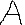
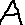
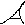
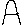

# Octet

Octet is an OCR model training system, this includes functionality for both **preparing and training** the data.

This system implements a rudimentary [K-NN](https://www.ibm.com/topics/knn) function to predict the similarity of an `OctetCharacter` which contains the raw image data (`unsigned char*`) against a pre-computed array of characters derived from  [`dataset/`](./dataset)

> **NOTE**
> Library under active development, things may change or break. I also appreciate any input on the code, cheers!

See:
- [Examples](#examples)
- [Gallery](#gallery)
- [Test](#Test)
- [Todo](#todo)

## Examples

### Prepare

Loading a dataset from a folder is slow since everytime pre-processing has to be applied. Hence it is adviced that the data be serialized as a CSV and read from there instead, here is what that may look like :-

```c
#include <octet.h>
  /* ... */

  OctetData* data;

  if (!dataFileExists) {
    data = octet_load_training_data_from_dir("./dataset");
    octet_write_training_data_to_csv("./data.csv");
  } else {
    data = octet_load_training_data_from_csv("./data.csv");
  }

  octet_free_training_data(data);

  /* ... */
```

### Train

```c
#include <octet.h>

  /* ... */

  OctetData* trainingData = octet_load_training_data_from_dir("./dataset");
  OctetCharacter* testCharacter = octet_load_character_from_image("./tests/test_data/test-A.jpg");

  char predictedLabel = octet_k_nearest_neighbour(testCharacter, trainingData, /* k */ 3);
  assert(predictedLabel == 'A');

  octet_free_character(testCharacter);
  octet_free_training_data(trainingData);

  /* ... */
```

## Gallery

| Input                                                          | Training Data                             | Match |
|----------------------------------------------------------------|-------------------------------------------|-------|
|          |  | A     |
|  |                                           |       |
|  |                                           |       |

## Test

```console
.\build.bat TEST
.\octet_test.exe
```

## TODO

- [ ] Squash the compiler warnings, run a static memory analyzer, format the code
- [ ] Further testing against varying levels of data, add more data to the [`dataset/`](./dataset)


